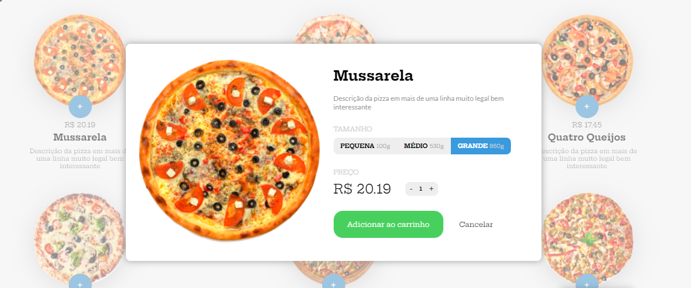
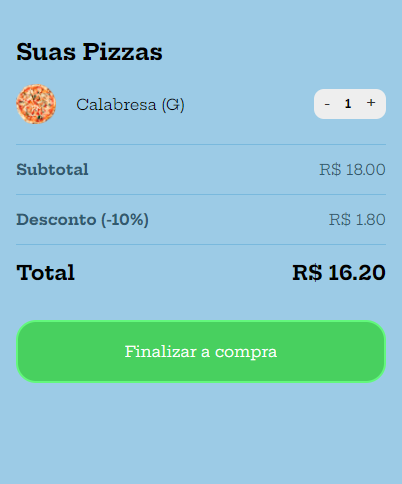

<em> Forma de Acesso ao Projeto: 👉 </em>  <a href="https://filipyj.github.io/compraDePizzas/" target="_blank"><strong> Compra de Pizzas </strong> </a>

 

<h1> Descrição do Projeto </h1>

 

    
 Essa ideia tem um propósito de simular a compra de pizzas de uma forma muito prática e simplificada, após entrar no site, o usuário seleciona os itens que ele deseja e logo após aparecerá uma janela dizendo a descrição do item, seguido de tamanhos, preços e quantidade, também é possível o usuário selecionar a quantidade de itens que vai querer antes de partir para a próxima etapa e finalizar a simulação.     
  

      <strong>O Carrinho:</strong>  
    O carrinho é facilmente acessível, é só seguir os passos acima e clicar em "Adicionar ao Carrinho" e pronto! na forma Web Ele aparecerá no lado direito da tela e na forma Mobile ele virá do canto direito cobrindo a tela, nele você consegue confirmar todos os itens que selecionou na etapa anterior e também fornece dados do respectivo pedido como SubTotal, Desconto e Total
        
  

 
 
 <h5> Projeto feito com o professor Bonieky da plataforma B7Web no curso de JavaScript </h1>
 
 

